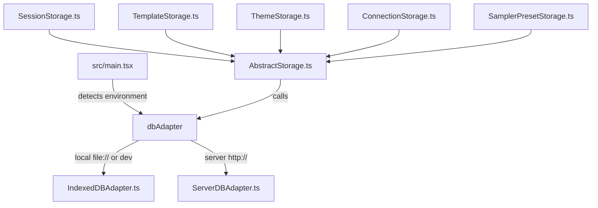

# Architecture

## 1. Storage Abstraction Layer

Miyapad is designed to run seamlessly as a fully self-contained local web app (storing data in the browser) or as a client connected to the Miyapad Node.js server. This is achieved via a pluggable database adapter interface:

- **`AbstractStorage` (`src/storage/AbstractStorage.ts`)**: Base class that coordinates database requests. It implements a **500ms debounced save queue** (`enqueueSave`) to avoid excessive disk/DB writes during rapid user editing.
- **`IndexedDBAdapter` (`src/storage/IndexedDBAdapter.ts`)**: Communicates with the browser's IndexedDB engine (Database `MiyaPad`, version 7). Handles database upgrades, persistence requests, exports, and imports.
- **`ServerDBAdapter` (`src/storage/ServerDBAdapter.ts`)**: Converts database calls to HTTP POST requests hitting the Express server REST endpoints.
- **`ConnectionStorage` (`src/storage/ConnectionStorage.ts`)**: Extends `AbstractStorage` to persist named connection presets (endpoint, API type, API key, model, per-API options). Follows the same pattern as `ThemeStorage` — `performFullSave` replaces the entire connections object (wrapped in try-catch with error dispatch), and `loadConnections` loads all records on init. The `Connections` store was introduced in IndexedDB v5 and is also available in SQLite server-side.
- **`SamplerPresetStorage` (`src/storage/SamplerPresetStorage.ts`)**: Extends `AbstractStorage` to persist named sampler parameter presets with all generation parameters (temperature, top-k, top-p, mirostat, DRY, XTC, etc.). Follows the same pattern as `ConnectionStorage` — `performFullSave` replaces the entire presets object, and `loadPresets` loads all records on init. The `SamplerPresets` store is available in both IndexedDB (v6) and SQLite server-side.
- **`SessionHistory` (`src/storage/SessionHistory.ts`)**: Extends `AbstractStorage` to keep saved versions of each session's content (prompt without per-token probabilities, memory, author's note, world info — never settings or the API key). Key `<sessionId>` holds that session's version index and `<sessionId>/<time>` one version; every write goes through the adapter's `batchMutation`, serialized by an internal queue. `SessionStorage` owns an instance (`sessionStorage.history`) and takes versions when a session opens, 60s after the last content change (`setProperty`), when switching away with one pending, before a large prompt deletion (`PromptContainer`, threshold from the `historyDeletionThreshold` preference), and before each generation when the `historyBeforeGenerate` preference is on (`useGenerationLogic`). A version identical to the latest is skipped, and only the newest `historyKeep` (default 30, read from localStorage at write time) are kept. Restoring either creates a new session (`restoreSnapshot`) or replaces the selected session's content (`overwriteWithSnapshot`, which versions the current content first and aborts if that fails, then reloads state through the `sessionchange` event). The store was introduced in IndexedDB v7 and is also a SQLite table server-side.
- **Named Storage Optimization**: To prevent massive performance degradation, session titles and metadata are indexed separately in a `names` table/store as a JSON object `{name, created, modified, pinned, tags, stats}`. This allows the dedicated Sessions Modal to quickly search, list, and sort sessions by creation or modification timestamps (and to float pinned sessions to the top) without pulling heavy compressed session history from the database. `stats` holds that session's lifetime counters (`generations`, `genTokens`, `genChars`, `genMs`, `typedChars`, `deletedChars`) for the same reason: since every session's metadata is already in memory, the Statistics modal can total them across all sessions without reading any session content. They are accumulated through `sessionStorage.addStats()` — once per generation from `useGenerationLogic`, and per transaction from the prompt editor, which skips any transaction the `ProseMirrorAdapter` tagged `PROGRAMMATIC_EDIT` so inserted templates and search-and-replace do not count as the user's own writing. Session ids reach the database through `sessionKey()`, which turns the string ids the Sessions Modal passes back into numbers: IndexedDB keys are type-sensitive, so without it a rename or a pin writes a second record under `"3"` and strands the one at `3`.

## 2. Context APIs & State Management

- **`SettingsContext` (`src/contexts/SettingsContext.tsx`)**: Holds global settings and generation hyperparameters (e.g., Temperature, Top-K, Min-P, Mirostat, Dry Sampler options, selected model endpoints, OpenAI keys, instruction templates, active themes, TTS voice settings). Also manages connection presets (`connections` via `useDBConnections`), per-session connection binding (`selectedConnectionId` via `useSessionState`), the persisted UI `locale` (see [Localization](#6-localization-i18n)), and the prompt `editorMode` (`source` vs `wysiwyg`, see [Prompt Editor](prompt-editor.md)).
- **`GenerationContext` (`src/contexts/GenerationContext.tsx`)**: Manages runtime generation and prompt state (e.g., prompt text chunks, total token count, generation speed, active abort controllers, undo/redo stacks, open modal states, and UI view toggles).

## 3. Type System

The project uses a **triple-tsconfig architecture**:

| Config | Location | Target | Module | Key Flags |
| :--- | :--- | :--- | :--- | :--- |
| **base** | `tsconfig.base.json` | ES2022 | — | `strict: true`, `noEmit: true` |
| **frontend** | `tsconfig.json` | ESNext | `bundler` resolution | `jsx: react-jsx` |
| **server** | `server/tsconfig.json` | ES2022 | `NodeNext` | `moduleResolution: NodeNext` |

All three configs enforce `strict: true`, disabling implicit `any`, enabling strict null checks, and requiring explicit return types on public API boundaries.

**Ambient type declarations** are organized in two `types/` directories:

- `src/types/` — Frontend-only declarations (`api.d.ts`, `components.d.ts`, `contexts.d.ts`, `defaults.d.ts`, `global.d.ts`, `storage.d.ts`)
- `server/types/` — Server-only declarations (`env.d.ts` for environment variable augmentation)

There is **no runtime validation library** (no zod, io-ts, or similar). TypeScript types are used purely for compile-time checking; no schema-based validation occurs at runtime.

## 4. LLM Provider API Layer

The `src/api/` directory implements a provider dispatch pattern for interfacing with different LLM backends. Each provider is a dedicated module exporting a consistent set of functions:

| Provider | Module | Completion | Chat Completion | Models | Token Count |
| :--- | :--- | :--- | :--- | :--- | :--- |
| **llama.cpp** | `llamacpp.ts` | `llamaCppCompletion` | — | — | `llamaCppTokenCount` |
| **KoboldCPP** | `koboldcpp.ts` | `koboldCppCompletion` | — | — | `koboldCppTokenCount` |
| **OpenAI Compatible** | `openai.ts` | `openaiCompletion` | `openaiChatCompletion` | `openaiModels` | host-aware |
| **DeepSeek** | `deepseek.ts` | `deepseekCompletion` | `deepseekChatCompletion` | `deepseekModels` | — |
| **AI Horde** | `aihorde.ts` | `aiHordeCompletion` | — | `aiHordeModels` | — |

The router in `src/api/index.ts` dispatches calls based on the `endpointAPI` constant (`src/constants.ts`). When a user selects "DeepSeek" in the sidebar (`API_DEEPSEEK = 5`), the endpoint is forced to `https://api.deepseek.com`, the server input becomes read-only, and all generation calls route through `deepseek.ts`. DeepSeek-specific behaviors include:

- Endpoints: `GET /models`, `POST /chat/completions`, `POST /beta/completions`
- Abort is a no-op (no server-side abort endpoint)
- Token counting is skipped entirely
- Logit bias uses OpenAI-compatible format
- Chat completions include `thinking: { type: "disabled" }` to disable reasoning models
- Default model: `deepseek-v4-flash` (configurable in UI)
- `strict` mode and `chatAPI` toggle are configurable (same as OpenAI Compatible) and applied on connection select

## 5. Key Custom Hooks

- **`usePromptBuilder` (`src/hooks/usePromptBuilder.ts`)**: Assembles the raw prompt injected into the LLM. It parses text, inserts instruct template tags (e.g. system messages, user instruction blocks, assistant headers), processes World Info (checking prompt text against regex keys), formats memory blocks, injects Author Notes at specified line depths, handles Fill-In-The-Middle (FIM) placeholders `{fill}` / `{predict}`, and converts conversational history to OpenAI-compatible messages.
- **`useGenerationLogic` (`src/hooks/useGenerationLogic.ts`)**: Manages the core prediction loop. It calls API completion engines, streams tokens back to the UI chunk by chunk, calculates generation speeds (tokens/sec), manages cancellation/abort signals, manages undo/redo state histories, and passes completed generation blocks to the Text-To-Speech queue.
- **`useTTS` (`src/hooks/useTTS.ts`)**: Interfaces with the Web Speech API to provide read-aloud capabilities for incoming tokens.

## 6. Localization (i18n)

UI strings are localized through a lightweight context in `src/i18n/`:

- **`locales.ts`** — `AVAILABLE_LOCALES` registry (e.g. `['en']`) and the derived `LocaleCode` type. This is the single source of truth for which languages exist.
- **`{code}.json`** — a flat `key → string` table per locale (`en.json` is the reference). Keys are dot-namespaced (e.g. `preferences.language`) and kept alphabetically sorted.
- **`context.tsx`** — `I18nProvider` and the `useT()` hook. `en.json` is statically imported as the default/fallback; any non-`en` locale in `AVAILABLE_LOCALES` is loaded lazily via dynamic `import()`. If loading fails or a locale is unregistered, it falls back to `en`. `useT()` returns `strings[key] ?? key`, so a missing key renders as the raw key.

The active locale lives in `SettingsContext` as `locale` (persisted to `localStorage` via `usePersistentState`). On first visit `detectLocale()` picks the browser language (`navigator.language` → primary subtag) if it's in `AVAILABLE_LOCALES`, otherwise `en`; once the user picks a language in **Preferences → General**, their stored choice wins. `App.tsx` reads `locale` from settings and passes it to `I18nProvider`, so switching languages re-renders the whole tree.

**Adding a language:** drop a `{code}.json` next to `en.json` and add its code to `AVAILABLE_LOCALES`. No other code changes are needed — the Preferences language selector (which renders each option's autonym via `Intl.DisplayNames`) and lazy loader pick it up automatically.

Out of scope: RTL layout, pluralization/interpolation (callers compose template strings themselves), and server-side strings.
