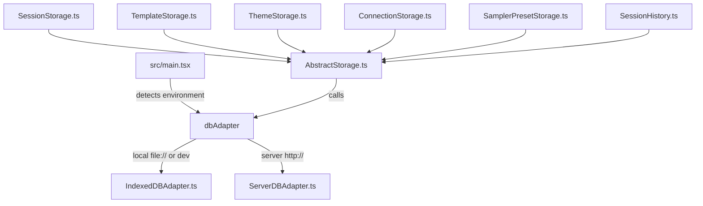

# Architecture

## 1. Storage Abstraction Layer

Miyapad runs two ways: as a self-contained local web app that keeps everything in the browser, or as a client of the Miyapad Node.js server. The same frontend does both through a pluggable database adapter interface.

- `AbstractStorage` (`src/storage/AbstractStorage.ts`): the base class that coordinates database requests. Its save queue (`enqueueSave`) debounces by 500 ms, so fast typing doesn't turn into a write per keystroke.
- `IndexedDBAdapter` (`src/storage/IndexedDBAdapter.ts`): talks to the browser's IndexedDB (database `MiyaPad`, version 7). Handles upgrades, persistence requests, exports and imports.
- `ServerDBAdapter` (`src/storage/ServerDBAdapter.ts`): turns database calls into HTTP POSTs against the Express server's REST endpoints.
- `ConnectionStorage` (`src/storage/ConnectionStorage.ts`): extends `AbstractStorage` to save named connection presets (endpoint, API type, API key, model, per-API options). It works like `ThemeStorage`: `performFullSave` replaces the whole connections object inside a try-catch that dispatches errors, and `loadConnections` loads every record on init. The `Connections` store was added in IndexedDB v5, and the server has it in SQLite too.
- `SamplerPresetStorage` (`src/storage/SamplerPresetStorage.ts`): extends `AbstractStorage` to save named sampler presets holding every generation parameter (temperature, top-k, top-p, mirostat, DRY, XTC and the rest). Same shape as `ConnectionStorage`: `performFullSave` replaces the whole presets object, and `loadPresets` loads all records on init. The `SamplerPresets` store is in IndexedDB (v6) and in the server's SQLite.
- `SessionHistory` (`src/storage/SessionHistory.ts`): extends `AbstractStorage` to keep saved versions of each session's content. A version holds the prompt without per-token probabilities, the memory, the author's note and the world info. It never holds settings or the API key. Key `<sessionId>` holds that session's version index and `<sessionId>/<time>` holds one version. Every write goes through the adapter's `batchMutation`, serialized by an internal queue.

  `SessionStorage` owns an instance (`sessionStorage.history`) and saves a version:
  - when a session opens,
  - 60s after the last content change (`setProperty`),
  - when you switch away with one pending,
  - before a large prompt deletion (`PromptContainer`, threshold from the `historyDeletionThreshold` preference),
  - before each generation, when the `historyBeforeGenerate` preference is on (`useGenerationLogic`).

  A version identical to the latest is skipped, and only the newest `historyKeep` versions are kept (default 30, read from localStorage at write time). Restoring either creates a new session (`restoreSnapshot`) or replaces the selected session's content (`overwriteWithSnapshot`). `overwriteWithSnapshot` saves a version of the current content first and aborts if that fails, then reloads state through the `sessionchange` event. The store was added in IndexedDB v7, and the server has it as a SQLite table.
- Named storage: session titles and metadata are indexed separately from session bodies, in a `names` table/store, as a JSON object `{name, created, modified, pinned, tags, folder, stats}`. Session bodies are large and compressed, so listing them would mean pulling every one out of the database. With the index, the Sessions Modal can search, list and sort by creation or modification time, float pinned sessions to the top, and group sessions into [folders](session-folders.md) without reading a single body.

  `stats` holds the session's lifetime counters (`generations`, `genTokens`, `genChars`, `genMs`, `typedChars`, `deletedChars`) for the same reason. Every session's metadata is already in memory, so the Statistics modal can total them across all sessions without reading any session content. They're added up through `sessionStorage.addStats()`: once per generation from `useGenerationLogic`, and once per transaction from the prompt editor. The editor skips any transaction the `ProseMirrorAdapter` tagged `PROGRAMMATIC_EDIT`, so inserted templates and search-and-replace don't count as your own writing.

  Session ids reach the database through `sessionKey()`, which turns the string ids the Sessions Modal passes back into numbers. IndexedDB keys are type-sensitive, so without it a rename or a pin would write a second record under `"3"` and strand the one at `3`.

## 2. Context APIs & State Management

- `SettingsContext` (`src/contexts/SettingsContext.tsx`): holds global settings and generation hyperparameters (temperature, top-k, min-p, mirostat, DRY sampler options, selected model endpoints, OpenAI keys, instruction templates, active themes, TTS voice settings). It also manages connection presets (`connections` via `useDBConnections`), the per-session connection binding (`selectedConnectionId` via `useSessionState`), the saved UI `locale` (see [Localization](#6-localization-i18n)) and the prompt `editorMode` (`source` or `wysiwyg`, see [Prompt Editor](prompt-editor.md)).
- `GenerationContext` (`src/contexts/GenerationContext.tsx`): manages runtime generation and prompt state: prompt text chunks, total token count, generation speed, active abort controllers, undo/redo stacks, which modals are open, and UI view toggles.

## 3. Type System

Three tsconfigs:

| Config | Location | Target | Module | Key Flags |
| :--- | :--- | :--- | :--- | :--- |
| **base** | `tsconfig.base.json` | ES2022 | — | `strict: true`, `noEmit: true` |
| **frontend** | `tsconfig.json` | ESNext | `bundler` resolution | `jsx: react-jsx` |
| **server** | `server/tsconfig.json` | ES2022 | `NodeNext` | `moduleResolution: NodeNext` |

All three inherit `strict: true`, so implicit `any` is an error and null checks are strict everywhere.

Ambient type declarations sit in two `types/` directories:

- `src/types/`: frontend only (`api.d.ts`, `components.d.ts`, `contexts.d.ts`, `defaults.d.ts`, `global.d.ts`, `storage.d.ts`)
- `server/types/`: server only (`env.d.ts`, for environment variable augmentation)

There is no runtime validation library (no zod, no io-ts, nothing like them). Types are checked at compile time only, and nothing validates data against a schema while the app runs.

## 4. LLM Provider API Layer

`src/api/` dispatches to the different LLM backends. Each provider is its own module exporting the same set of functions:

| Provider | Module | Completion | Chat Completion | Models | Token Count |
| :--- | :--- | :--- | :--- | :--- | :--- |
| **llama.cpp** | `llamacpp.ts` | `llamaCppCompletion` | — | — | `llamaCppTokenCount` |
| **KoboldCPP** | `koboldcpp.ts` | `koboldCppCompletion` | — | — | `koboldCppTokenCount` |
| **OpenAI Compatible** | `openai.ts` | `openaiCompletion` | `openaiChatCompletion` | `openaiModels` | host-aware |
| **DeepSeek** | `deepseek.ts` | `deepseekCompletion` | `deepseekChatCompletion` | `deepseekModels` | — |
| **AI Horde** | `aihorde.ts` | `aiHordeCompletion` | — | `aiHordeModels` | — |

The router in `src/api/index.ts` picks one based on the `endpointAPI` constant (`src/constants.ts`). Picking "DeepSeek" in the sidebar (`API_DEEPSEEK = 5`) forces the endpoint to `https://api.deepseek.com`, makes the server input read-only, and sends every generation call through `deepseek.ts`. DeepSeek differs from the other providers in a few ways:

- Endpoints: `GET /models`, `POST /chat/completions`, `POST /beta/completions`
- Abort does nothing, since there is no server-side abort endpoint
- Token counting is skipped entirely
- Logit bias uses the OpenAI-compatible format
- Chat completions send `thinking: { type: "disabled" }` to switch reasoning off
- The default model is `deepseek-v4-flash`, and you can change it in the UI
- `strict` mode and the `chatAPI` toggle work the same as for OpenAI Compatible, and are applied when a connection is selected

## 5. Custom Hooks

- `usePromptBuilder` (`src/hooks/usePromptBuilder.ts`): builds the raw prompt sent to the LLM. It parses the text, inserts instruct template tags (system messages, user instruction blocks, assistant headers), runs World Info by matching the prompt text against regex keys, formats memory blocks, injects the author's note at the configured line depth, handles the Fill-In-The-Middle placeholders `{fill}` and `{predict}`, and converts conversation history into OpenAI-compatible messages.
- `useGenerationLogic` (`src/hooks/useGenerationLogic.ts`): runs the prediction loop. It calls the API completion functions, streams tokens back to the UI chunk by chunk, works out generation speed in tokens/sec, handles cancellation and abort signals, maintains the undo/redo histories, and hands finished generation blocks to the text-to-speech queue.
- `useTTS` (`src/hooks/useTTS.ts`): reads incoming tokens aloud through the Web Speech API.

## 6. Localization (i18n)

UI strings are localized through a small context in `src/i18n/`:

- `locales.ts`: the `AVAILABLE_LOCALES` registry (e.g. `['en']`) and the `LocaleCode` type derived from it. This is the one place that says which languages exist.
- `{code}.json`: a flat `key → string` table per locale (`en.json` is the reference). Keys are dot-namespaced (e.g. `preferences.language`) and kept in alphabetical order.
- `context.tsx`: `I18nProvider` and the `useT()` hook. `en.json` is imported statically as the default and fallback. Any other locale in `AVAILABLE_LOCALES` is loaded lazily with a dynamic `import()`. If loading fails or a locale isn't registered, it falls back to `en`. `useT()` returns `strings[key] ?? key`, so a missing key shows up as the raw key.

The active locale lives in `SettingsContext` as `locale`, saved to `localStorage` via `usePersistentState`. On the first visit, `detectLocale()` takes the browser language (the primary subtag of `navigator.language`) if it's in `AVAILABLE_LOCALES`, and `en` otherwise. Once you pick a language in Preferences → General, that choice wins. `App.tsx` reads `locale` from settings and passes it to `I18nProvider`, so switching languages re-renders the whole tree.

To add a language, drop a `{code}.json` next to `en.json` and add its code to `AVAILABLE_LOCALES`. No other code changes are needed. The language selector in Preferences (which shows each language's name in that language, via `Intl.DisplayNames`) and the lazy loader pick it up.

Not supported: RTL layout, pluralization and interpolation (callers build template strings themselves), and server-side strings.
